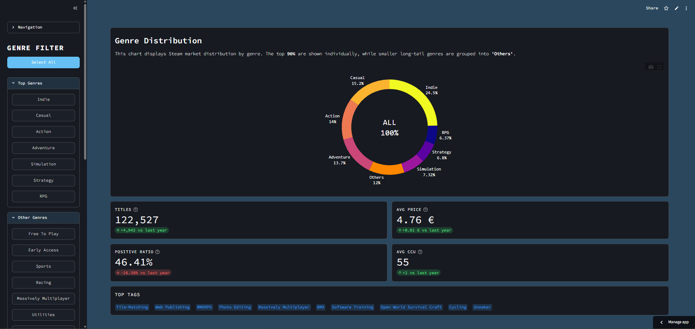
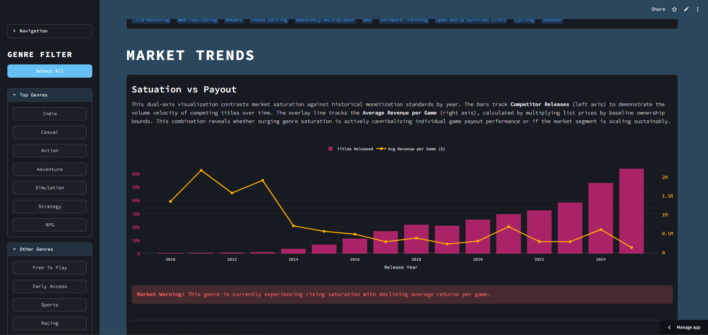
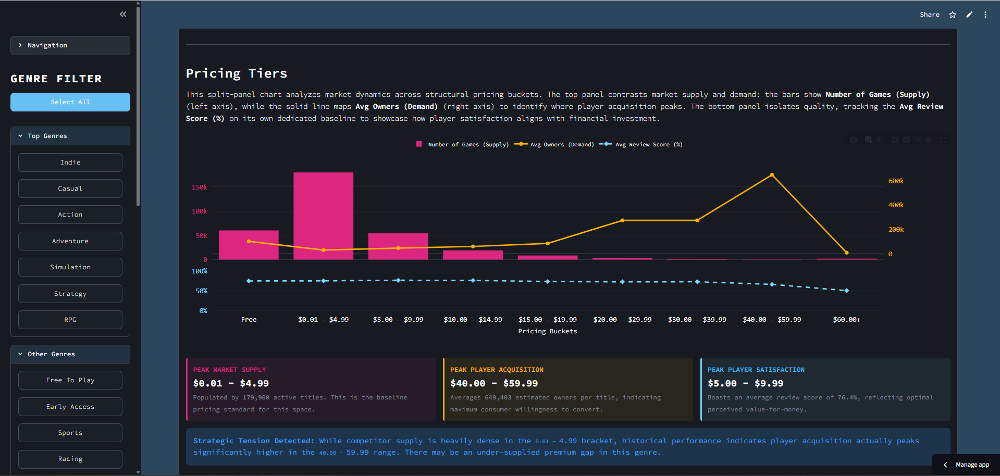
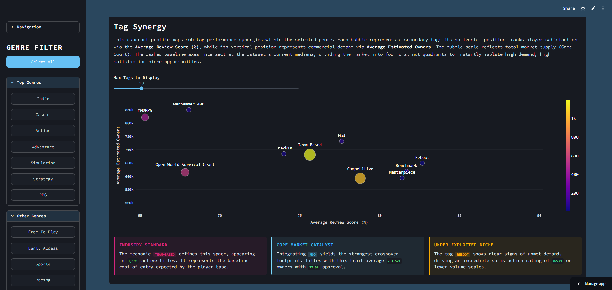
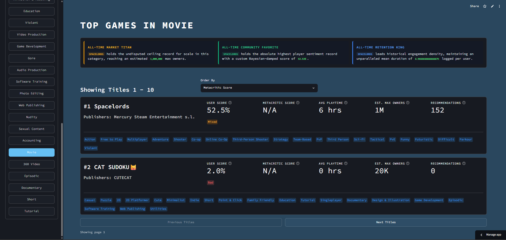

## About
A Data-Visualiuzation Dashboard built using Streamlit in Python. Developed heavily using AI in accordance with, and for the Unviersity Course "Usability".

 This Dashboard visualizes Steam industry Data to uncover consumer trends, competitive Baselines, and commercial Gaps across market Segments. It is designed as an explanatory Tool built with a focus on usability, utilizing a modern Flat Design, color-blind safe Palettes, and automated Data storytelling to minimize cognitive load. 

**Tech Stack:** Streamlit, Pandas, DuckDB, Plotly

## Key Features

* **Global Genre Filtering:** A collapsible sidebar allows users to isolate specific Genres globally across all visualizations and Metrics.
  
* **Automated Insights:** The dashboard automatically extracts and highlights key Insights and actionable Takeaways directly next to the charts, eliminating the need for manual data Interpretation.

* **Market Distribution & KPIs:** View the Market-Share of Genres. Automated KPI-Cards extract critical Data such as Total Titles, Average Price, Positive Ratio, and Average CCU.

* **Market Trends:** A dual-axis Visualization that contrasts historical Competitor releases against average Revenue per Game, helping to identify if a Genre is oversaturated or scaling sustainably.

* **Pricing Tiers:** A split-panel Chart analyzing Market Dynamics across pricing Buckets. It compares market Supply, Demand, and Quality to identify optimal pricing Strategies.

* **Tag Synergies:** A scatter Plot mapping Tag performance. It tracks Player satisfaction against commercial demand, isolating high-demand, high-satisfaction Ppportunities.

* **Top Titles:** A sortable data View highlighting the top-performing Games in a selected category.

